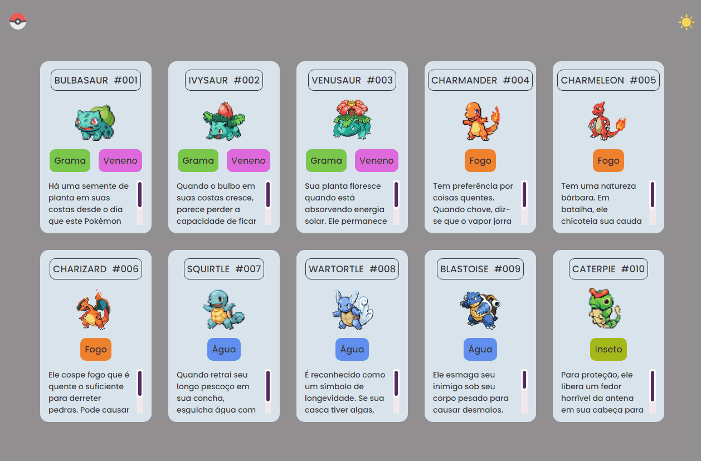

# Projeto Pokemon README
Este foi o meu primeiro projeto com as tecnologias básicas do frontend; agora com README 🚀

## Tecnologias Utilizadas
- HTML   
- CSS 
- JS

## Como utilizar
Sendo um projeto bem básico, no momento, a única interação seria a mudança de tema na tela principal.

## Aprendizado
Aprendi o básico sobre HTML, CSS e JS.

## Dificuldades
As maiores dificuldades foram fazer os dimensionamentos das box no CSS.

